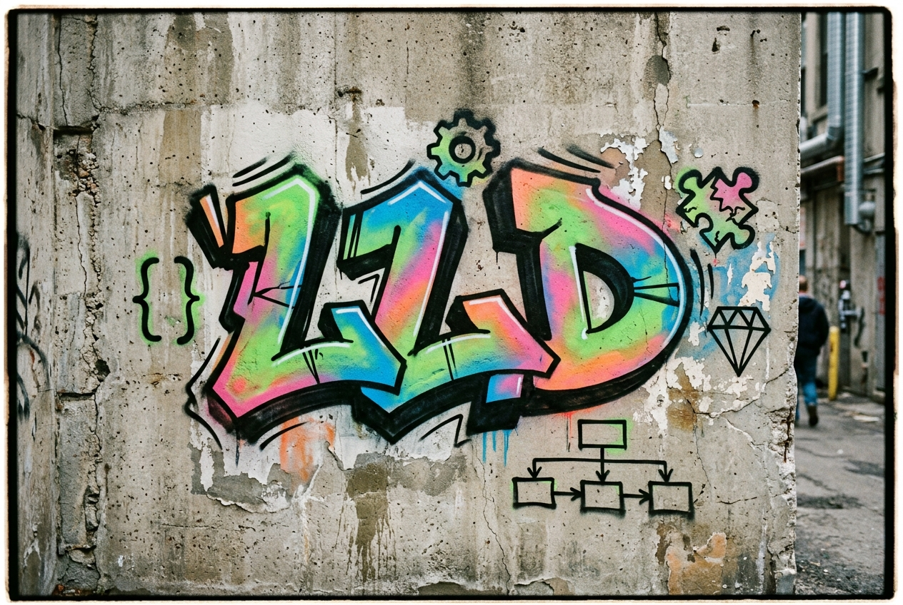

# Low Level Design (LLD)

  

Welcome to my LLD repository! This workspace contains my notes, explorations, and code implementations for various Low Level Design (LLD) concepts, Object-Oriented principles, and Design Patterns.

---

## Contents

- [Creational Design Patterns](#creational-design-patterns)
  - [Overview & Quick Links](#overview--quick-links)
  - [1. Factory Pattern](#1-factory-pattern)
  - [2. Abstract Factory Pattern](#2-abstract-factory-pattern)
  - [3. Singleton Pattern](#3-singleton-pattern)
  - [4. Builder Pattern](#4-builder-pattern)
  - [5. Prototype Pattern](#5-prototype-pattern)
- [Creational Summary Table](#creational-summary-table)
- [Behavioral Design Patterns](#behavioral-design-patterns)
  - [Overview & Quick Links](#overview--quick-links-1)
  - [1. Strategy Pattern](#1-strategy-pattern)
  - [2. Observer Pattern](#2-observer-pattern)
  - [3. Command Pattern](#3-command-pattern)
  - [4. Template Pattern](#4-template-pattern)
  - [5. State Pattern](#5-state-pattern)
  - [6. Chain of Responsibility Pattern](#6-chain-of-responsibility-pattern)
- [Behavioral Summary Table](#behavioral-summary-table)

---

## Creational Design Patterns

Creational design patterns focus on how objects are created. Instead of creating objects directly in the main code, these patterns help create objects in a cleaner, organized, and flexible way.

### Overview & Quick Links

| Pattern | What it does | Java Code |
| :--- | :--- | :--- |
| **Factory Pattern** | Creates different objects in one place based on requirements. | [`Factory.java`](./Creational%20Patterns/Factory.java) |
| **Abstract Factory Pattern** | Creates families of related objects together without specifying exact classes. | [`AbstractFactory.java`](./Creational%20Patterns/AbstractFactory.java) |
| **Singleton Pattern** | Keeps and gives access to only one instance of a class across the app. | [`Singletone.java`](./Creational%20Patterns/Singletone.java) |
| **Builder Pattern** | Builds complex objects step-by-step using method chaining. | [`Builder.java`](./Creational%20Patterns/Builder.java) |
| **Prototype Pattern** | Creates new objects by cloning an existing object instead of starting from scratch. | [`Prototype.java`](./Creational%20Patterns/Prototype.java) |
| **My Raw Notes** | Original notes file. | [`Notes.txt`](./Creational%20Patterns/Notes.txt) |

---

### 1. Factory Pattern

#### **Q. What is the Factory Pattern?**
**Ans:** A creational design pattern used to create different objects based on requirements without exposing the creation logic directly.

#### **Q. What problem does it solve?**
**Ans:** It helps create objects in a centralized place without making the main code messy or cluttered.

#### **Q. How is it implemented?**
**Ans:** Create a factory class with a method (like `getVehicle(type)`) that checks conditions and returns the required object.

#### **Q. Real-world example?**
**Ans:** A `VehicleFactory` class that returns different vehicle objects like `Bike`, `Car`, or `Bus` based on what you pass to it.

> **Code:** [`Factory.java`](./Creational%20Patterns/Factory.java)

---

### 2. Abstract Factory Pattern

#### **Q. What is the Abstract Factory Pattern?**
**Ans:** A creational design pattern that provides an interface for creating families of related objects without specifying their concrete classes.

#### **Q. What problem does it solve?**
**Ans:** When we need to create multiple related objects, Abstract Factory separates their creation into different factories and ensures that related objects are created together.

#### **Q. How is it implemented?**
**Ans:** Create an abstract factory interface with methods to create each product. Then create separate factory classes (like `BMWfactory` and `KTMfactory`) that implement it.

#### **Q. Real-world example?**
**Ans:** Different product families based on vehicle brands: `BMWfactory` creates BMW-related vehicles and `KTMfactory` creates KTM-related vehicles.

> **Code:** [`AbstractFactory.java`](./Creational%20Patterns/AbstractFactory.java)

---

### 3. Singleton Pattern

#### **Q. What is the Singleton Pattern?**
**Ans:** A creational design pattern that ensures only one instance of a class exists throughout the system and provides a global way to access it.

#### **Q. What problem does it solve?**
**Ans:** It makes sure only one instance of a class exists when having multiple instances is unnecessary or causes problems (like multiple database connections fighting each other).

#### **Q. How is it implemented?**
**Ans:**
1. Create a class with a `private` constructor so nobody can call `new` directly.
2. Keep a `static` instance of the class inside it.
3. Every time `getInstance()` is called, check if the instance is already available. If not, create it, and then return it.

#### **Q. Real-world example?**
**Ans:** A single database connection for an application, or a shared logger.

> **Code:** [`Singletone.java`](./Creational%20Patterns/Singletone.java)

---

### 4. Builder Pattern

#### **Q. What is the Builder Pattern?**
**Ans:** A creational design pattern that allows you to build objects with complex data and lots of optional fields.

#### **Q. What problem does it solve?**
**Ans:** It is tedious and repetitive to call constructors that have too many parameters and optional fields.

#### **Q. How is it implemented?**
**Ans:**
1. Inside the target class, create a static `Builder` class with the same fields.
2. Write setter methods in a way that each method returns `this` (to form a chain-like pattern).
3. Add a `build()` method that creates and returns the target object with the set values.

#### **Q. Real-world example?**
**Ans:** Java's `StringBuilder` or building an `HttpRequest`.

> **Code:** [`Builder.java`](./Creational%20Patterns/Builder.java)

---

### 5. Prototype Pattern

#### **Q. What is the Prototype Pattern?**
**Ans:** A creational design pattern that creates new objects by cloning an existing object (the prototype) instead of creating and setting up a new object from scratch.

#### **Q. What problem does it solve?**
**Ans:** When creating and setting up an object is complex or heavy, Prototype allows us to quickly create a new object by copying an already configured one.

#### **Q. How is it implemented?**
**Ans:** When a new object is needed, clone the prototype instead of creating it from scratch. A factory or registry can optionally store and provide the prototypes.

#### **Q. Real-world example?**
**Ans:** Creating characters or enemies in game development, or copying UI widgets in GUI frameworks.

> **Code:** [`Prototype.java`](./Creational%20Patterns/Prototype.java)

---

## Creational Summary Table

| Pattern | In Simple Words | Main Benefit | When to Use |
| :--- | :--- | :--- | :--- |
| **Factory** | One method decides which object to create | Cleans up object creation from main code | When you have different subclasses based on an input |
| **Abstract Factory** | Factory of factories for related objects | Keeps related objects compatible | When working with product families (e.g. BMW vs KTM) |
| **Singleton** | Only one single instance exists everywhere | Prevents conflicts and saves resources | Database connection, app logger, cache |
| **Builder** | Builds an object step-by-step with chaining | No giant constructors with lots of nulls | When an object has many optional fields |
| **Prototype** | Copies an existing object | Saves time when object setup is complex | Spawning game objects, copying configured templates |

---

## Behavioral Design Patterns

Behavioral design patterns focus on how objects talk to each other. Instead of tightly coupling objects together, these patterns help organize communication and responsibilities in a clean and flexible way.

### Overview & Quick Links

| Pattern | What it does | Java Code |
| :--- | :--- | :--- |
| **Strategy Pattern** | Lets you switch the algorithm at runtime without changing client code. | [`Strategy.java`](./Behavioral%20Patterns/Strategy.java) |
| **Observer Pattern** | Lets an object notify other objects whenever a certain event happens. | [`Observer.java`](./Behavioral%20Patterns/Observer.java) |
| **Command Pattern** | Turns a request into an object so it can be logged, undone, or queued. | [`CommandP.java`](./Behavioral%20Patterns/CommandP.java) |
| **Template Pattern** | Defines the blueprint of an algorithm in a parent class, lets subclasses override specific steps. | [`Template.java`](./Behavioral%20Patterns/Template.java) |
| **State Pattern** | Lets an object change its behavior based on its current state. | [`State.java`](./Behavioral%20Patterns/State.java) |
| **Chain of Responsibility Pattern** | Passes a request through a chain of handlers until one handles it. | [`ChainOfResponsibility.java`](./Behavioral%20Patterns/ChainOfResponsibility.java) |
| **My Raw Notes** | Original notes file. | [`Notes.txt`](./Behavioral%20Patterns/Notes.txt) |

---

### 1. Strategy Pattern

#### **Q. What is the Strategy Pattern?**
**Ans:** A behavioral design pattern that allows us to switch the algorithm at runtime. There can be multiple ways to do the same task, and we pick which one to execute at runtime.

#### **Q. What problem does it solve?**
**Ans:** Hardcoding the logic in client code makes it cluttered and violates SRP (Single Responsibility Principle).

#### **Q. How is it implemented?**
**Ans:** Create different strategy classes that implement a common `Strategy` interface. Then assign the desired strategy to a reference of that interface and call it.

#### **Q. Real-world example?**
**Ans:** Payment processors (credit card, crypto, UPI) or navigation apps (driving, walking, cycling routes).

> **Code:** [`Strategy.java`](./Behavioral%20Patterns/Strategy.java)

---

### 2. Observer Pattern

#### **Q. What is the Observer Pattern?**
**Ans:** A behavioral design pattern that allows an object (subject) to notify other objects whenever a certain event occurs.

#### **Q. What problem does it solve?**
**Ans:** It avoids tightly coupling the object generating an event with the objects that need to react to it.

#### **Q. How is it implemented?**
**Ans:** Create a subject that maintains a list of observers. Provide methods to add/remove observers and call their notification method when something happens.

#### **Q. Real-world example?**
**Ans:** YouTube channels notifying subscribers, stock market price alerts, or event systems in game development.

> **Code:** [`Observer.java`](./Behavioral%20Patterns/Observer.java)

---

### 3. Command Pattern

#### **Q. What is the Command Pattern?**
**Ans:** A behavioral design pattern that allows you to treat a request as an object, keeping the code loosely coupled.

#### **Q. What problem does it solve?**
**Ans:** It decouples the object that requests an operation from the object that actually performs it. Also allows requests to be logged, undone, queued, or executed later.

#### **Q. How is it implemented?**
**Ans:** Create a `Command` interface with an `execute()` method. Create concrete classes for different actions. Each command holds a reference to a receiver that does the actual work. An invoker receives and executes the command.

#### **Q. Real-world example?**
**Ans:** TV remote controls, game development input handling, or remote procedure calls in IoT.

> **Code:** [`CommandP.java`](./Behavioral%20Patterns/CommandP.java)

---

### 4. Template Pattern

#### **Q. What is the Template Pattern?**
**Ans:** A behavioral design pattern that defines the blueprint of an algorithm in a parent class and lets subclasses override specific steps.

#### **Q. What problem does it solve?**
**Ans:** Avoids duplication of code when multiple classes follow the same sequence of steps to perform a task, but some steps differ in implementation.

#### **Q. How is it implemented?**
**Ans:** Create an abstract class that defines a template method containing the skeleton of the algorithm. Subclasses override the specific steps they need to change.

#### **Q. Real-world example?**
**Ans:** Algorithm implementations where the overall flow is the same but individual steps vary.

> **Code:** [`Template.java`](./Behavioral%20Patterns/Template.java)

---

### 5. State Pattern

#### **Q. What is the State Pattern?**
**Ans:** A behavioral design pattern where objects can alter their behavior based on their current state. It encapsulates state-specific behavior into separate classes, keeping things modular and scalable.

#### **Q. What problem does it solve?**
**Ans:** Implementing state-dependent behavior directly in the main class makes code cluttered with if-else blocks checking the current state.

#### **Q. How is it implemented?**
**Ans:** Create a class for each state that defines the behavior. Each state class can also have a `nextState()` method that assigns the next state class instance to the context. (`nextState()` isn't a mandatory part of the State Pattern.)

#### **Q. Real-world example?**
**Ans:** Programming card games like UNO or Rummy, or game character states like Idle → Running → Jumping → Falling → Dead.

> **Code:** [`State.java`](./Behavioral%20Patterns/State.java)

---

### 6. Chain of Responsibility Pattern

#### **Q. What is the Chain of Responsibility Pattern?**
**Ans:** A behavioral design pattern that passes the request through a chain of handlers until one of them handles it.

#### **Q. What problem does it solve?**
**Ans:** Avoids a giant if-else block to resolve requests, where the logic of handling is tightly coupled.

#### **Q. How is it implemented?**
**Ans:** The main idea is one object says, "if I can't resolve this, I'll pass it to the next one." Objects are linked together. If one is unable to resolve the request, it just passes it along.

#### **Q. Real-world example?**
**Ans:** Leave approval systems, or game damage handlers like Attack → Shield → Armor → Player.

> **Code:** [`ChainOfResponsibility.java`](./Behavioral%20Patterns/ChainOfResponsibility.java)

---

## Behavioral Summary Table

| Pattern | In Simple Words | Main Benefit | When to Use |
| :--- | :--- | :--- | :--- |
| **Strategy** | Swap algorithms at runtime | No hardcoded logic, clean switching | Payment methods, sorting algorithms, navigation routes |
| **Observer** | One object notifies many others | Loose coupling between event producer and consumers | YouTube subscriptions, stock alerts, game events |
| **Command** | Wrap a request as an object | Can undo, queue, or log operations | Remote controls, undo/redo, task scheduling |
| **Template** | Define algorithm skeleton, override specific steps | Avoids code duplication across similar workflows | Algorithm implementations, data processing pipelines |
| **State** | Behavior changes based on current state | No cluttered if-else state checks | Game character states, card games, traffic lights |
| **Chain of Responsibility** | Pass request down a chain until handled | Decouples request sender from handler | Leave approvals, game damage handling, middleware |

---
